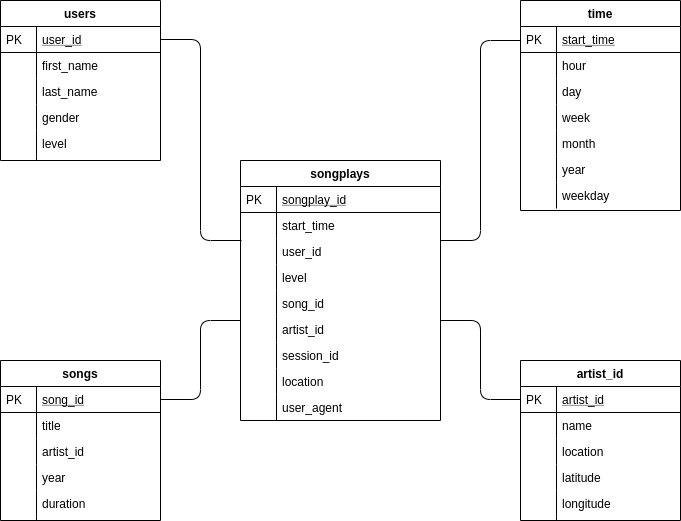

## Data Warehouse on AWS with Redshift

### Project summary
A startup called Sparkify wants to analyze the data they've been collecting on songs and user activity on their new music streaming app. The analytics team is particularly interested in understanding what songs users are listening to. Currently, they don't have an easy way to query their data, which resides in S3, in a directory of JSON logs on user activity on the app, as well as a directory with JSON metadata on the songs in their app.

The task is to build an ETL Pipeline that extracts their data from S3, staging it in Redshift and then transforming the data into a set of Fact  and Dimensional Tables for the Analytics Team.

### Required libraries

- pandas
- psycopg2
- sql_queries

### Python scripts

- create_tables.py: Script to creates the tables.
- sql_queries.py: All queries used in the ETL pipeline.
- etl.py: Script to starts the pipeline which will read the data from files and populate the tables.


### Database Schema
<p align="center">
  
</p>


### Usage

Create tables and execute ETL.
* Update the `dwh.cfg` file with your Amazon Redshift cluster credentials and IAM role that can access the cluster.
* Run
```
$ python3 create_tables.py
$ python3 etl.py
```

### Check results
Results can be tested by running the code cells inside the jupyter notebook:
```
test.ipynb
```
